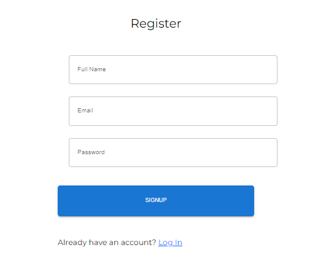
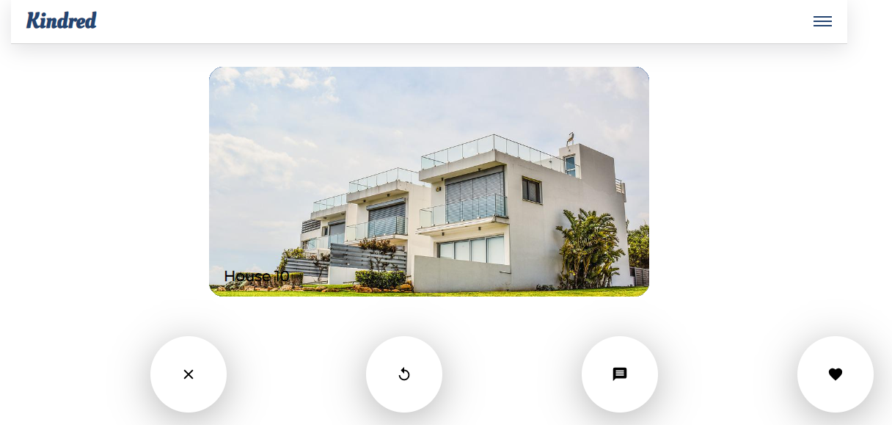
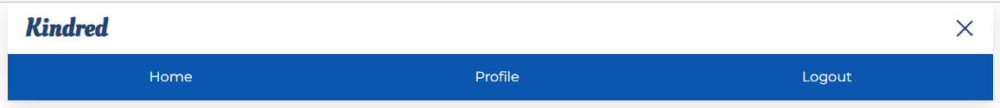
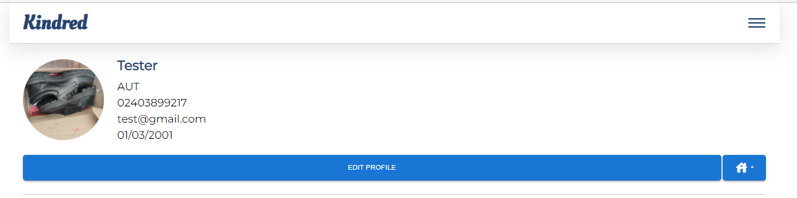
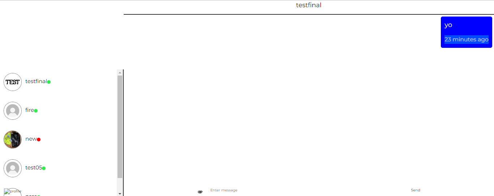

# Name

Kindred Application

## Description

Our application is for roomate seekers, it is a medium to connect people who are looking to rent houses with other people.\
So far our application has the following features:

### Signup page

This is the page for new users to create their account, so they can gain access into the application.

### Login page

This is the page used to gain access into the application, only users who have previously creted an account can log in.

### Homepage

This is the first page the user who logs in sees, this is the page that leads to other parts of the application and displays the houses available for rent.

### Navigation Bar

This is located on the hompegae and the profile page. The navigation bar has 3 options available - Home, Profile, and logout.

### Profile Page

This is the page where the user details are stored in, the users are able to edit their profiles using the 'EDIT PROFILE' button.

### Message Page

This page is where the messaging magic happens. On this page you can see whos is online and who is not, you can also send texts and pictures.

## Installation

Pull the code from GitHub and use one of the following scripts options to run the application (if you are using React.js)

### `npm start`

Runs the app in the development mode.\
Open [http://localhost:3000](http://localhost:3000) to view it in your browser.

The page will reload when you make changes.\
You may also see any lint errors in the console.

### `npm test`

Launches the test runner in the interactive watch mode.\
See the section about [running tests](https://facebook.github.io/create-react-app/docs/running-tests) for more information.

### `npm run build`

Builds the app for production to the `build` folder.\
It correctly bundles React in production mode and optimizes the build for the best performance.

The build is minified and the filenames include the hashes.\
Your app is ready to be deployed!

See the section about [deployment](https://facebook.github.io/create-react-app/docs/deployment) for more information.

### `npm run eject`

**Note: this is a one-way operation. Once you `eject`, you can't go back!**

If you aren't satisfied with the build tool and configuration choices, you can `eject` at any time. This command will remove the single build dependency from your project.

Instead, it will copy all the configuration files and the transitive dependencies (webpack, Babel, ESLint, etc) right into your project so you have full control over them. All of the commands except `eject` will still work, but they will point to the copied scripts so you can tweak them. At this point you're on your own.

You don't have to ever use `eject`. The curated feature set is suitable for small and middle deployments, and you shouldn't feel obligated to use this feature. However we understand that this tool wouldn't be useful if you couldn't customize it when you are ready for it.

## Contributing

Feel free to create a pull request if you would like to contibute. For major changes, please leave comments in your code and create an issue to discuss about your implementation

## Authors and Acknowledgement

### Authors

- Renjo Angeles
- Eniola Omisakin

### Acknowledgement

- Farhan Farooq (https://www.youtube.com/channel/UCxBXSL74oOJ_0yqC4bHc18Q)
- Clever Programmer https://www.youtube.com/c/CleverProgrammer
